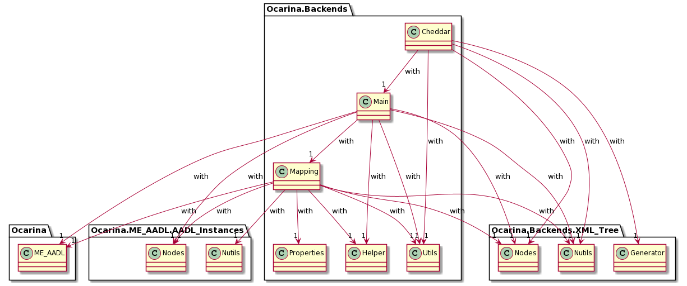

# Implementation overview

This documents is an helper to find and understand the elements of implementation in the Ocarina code. We also discuss implementation choices.

## Packages

The Ocarina code is organized in modules called *packages* that can be found in the ``ocarina/src`` directory,  with every package has a *specification* and a *body* (the file extension .ads is for a specification and .adb for a body). 

The implementation of the *AADL2Cheddar* model transformation is found in the Cheddar backend, which uses related Abstract Syntax Trees (i.e. the AADL Instance Tree and the XML Tree). The following class diagram shows an overview of the Cheddar backend: 

 

## Cheddar backend

The Cheddar backend ([``Ocarina.Backends.Cheddar``](./ocarina/src/backends/cheddar/ocarina-backends-cheddar.ads)) implements a set of routines to transform an AADL model into a Cheddar ADL model. More precisely, it **generates** an XML file compatible with the Cheddar tool (see ``procedure Generate``) using:  
* a set of procedures to **visit** the AADL Instance Tree (e.g. see ``procedure Visit`` in [``Ocarina.Backends.Cheddar.Main``](./ocarina/src/backends/cheddar/ocarina-backends-cheddar-main.ads)) that starts from the root node and does a traversal for each compilation unit to be transformed (i.e. System, Processor, Thread, etc.) 
* a set of **mapping** functions ("transformation rules") applied over visited nodes of the AIT (e.g. ``Map_Processor`` in [``Ocarina.Backends.Cheddar.Mapping``](./ocarina/src/backends/cheddar/ocarina-backends-cheddar-mapping.ads)) 

## AADL Instance Tree

The AADL Instance Tree is defined in [``Ocarina.ME_AADL.AADL_Instances``](./ocarina/src/core/tree/ocarina-me_aadl-aadl_instances.ads), with: 
* [``Ocarina.ME_AADL.AADL_Instances.Nodes``](./ocarina/src/core/tree/ocarina-me_aadl-aadl_instances-nodes.idl) defines the tree structure
* [``Ocarina.ME_AADL.AADL_Instances.Nutils``](./ocarina/src/core/tree/ocarina-me_aadl-aadl_instances-nutils.ads) defines functions to manipulate the tree

## XML Tree 

The XML Tree is defined in [``Ocarina.Backends.XML_Tree``](./ocarina/src/backends/ast_xml/ocarina-backends-xml_tree.ads) with 
* [``Ocarina.Backends.XML_Tree.Nodes``](./ocarina/src/backends/ocarina-backends-xml_tree-nodes.idl) defines the tree structure
* [``Ocarina.Backends.XML_Tree.Nutils``](./ocarina/src/backends/ast_xml/ocarina-backends-xml_tree-nutils.ads) defines functions to manipulate the tree
* [``Ocarina.Backends.XML_Tree.Generator``](./ocarina/src/backends/ast_xml/ocarina-backends-xml_tree-generator.ads) generates the XML code from the XML Tree (see ``procedure Generate``)  

## Implementation choices

### Mapping transformation rules to Ada functions

Formal transformation rules (R1 to R9) are mapped to [functions](./ocarina/src/backends/cheddar/ocarina-backends-cheddar-mapping.ads), given that a function implements all the rules operations related to a *category* of AADL component in the visited AADL Instance Tree. For example, the ``function Map_Thread`` implements all the transformation operations related to a thread component, thus implementing operations of R3 (translating threads into tasks), R6 (translating the thread parent process binding into a task-execution unit link), R7 (translating the thread parent process into a task-address space link) and R9 (translating the thread properties into task parameters). 

Applying this strategy results in 4 functions that implement the 9 transformation rules, with the mapping given bellow. 

| Function	| Rule	 		|
|---------------|-----------------------|
| Map_Processor | R1, R9     		|
| Map_Process   | R2, R9     		|
| Map_Thread    | R3, R6, R7, R9 	|
| Map_Data      | R4, R5, R8, R9  	|

### Implementation of contracts

The assumptions/guarantees of formal contracts are implemented via **preconditions**/**postconditions**, as part of the functions declarations (see examples in [``Ocarina.Backends.Cheddar.Mapping``](./ocarina/src/backends/cheddar/ocarina-backends-cheddar-mapping.ads)). Accessors over the AADL Instance Tree are provided (see [``Ocarina.Backends.Properties``](./ocarina/src/backends/ocarina-backends-properties.ads), [``Ocarina.Backends.Helper``](./ocarina/src/backends/ocarina-backends-helper.ads) and [``Ocarina.Backends.Utils``](./ocarina/src/backends/ocarina-backends-utils.ads)) to build Boolean expressions in preconditions/postconditions.
